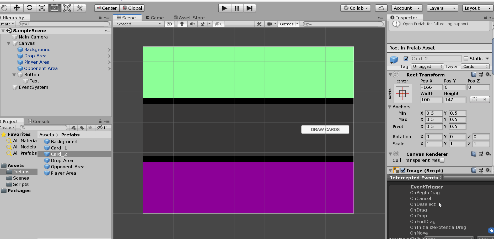

## Vanja Venezia - Milestone #1 Dev Diary

I'm coming into this project feeling relatively confident. The ball roller game was my first time using Unity or C# so I was a bit nervous about how it would go. However, upon completing that tutorial, I realized how similar Unity is to YoyoGames Game Maker and Game Maker Studio, which I took classes in as a kid and grew up making simple games in. The aspects that are different are pretty similar to Maya, which I learned in high school, so overall the featureset will take some getting used to and practice of course, but feels quite familiar which is relieving!

I just started the card game tutorial and realized I should probably start the dev diary so I could follow along and write as I go through the project.

--

I'm about half way through the tutorial and it has frozen to buffer, so this seems like a good time for a dev diary update.

The way that buttons work is not very intuitive with regards to scripting but I can definitely live with it. So far the tutorial has been incredibly simple to follow and thorough, which is always nice. I'm having an issue where my canvas size with the constant pixel scale scaler option selected is a different size and aspect ratio than the canvas in the video. I've done some googling and searched around the menus and haven't really found a way to alter the X and Y dimensions unless I use a different scaler setting. It's odd but I'm changing the scaling of the UI elements to fit better in the smaller area I'm working with, so not a major issue.

C# is a bit bizarre in comparison to C++, I can't tell if it's the lanugage itself or the Unity toolset, probably a combination of both. It's just quite wordy for Unity scripting. I realize that the Unity toolset is complex and deep so there needs to be these long strings of nested function calls and sub-objects etc. I'm slowly adjusting.

--

Most of the way through the tutorial at this point, a bit suprised by just how broken this card game engine is only 6 minutes from the end, but I do feel more comfortable in Unity. It has a lot of quirks but nothing too ridiculous. I really need to figure out this canvas size issue because it makes this a lot more difficult than it probably needs to be, but the struggle is where the learning happens so maybe it's a good thing!

--

Ok, I've finished and about to record a gif with LICEcap. I fixed all errors with the game that I was experiencing and now it has functionality equivalent to the game in the tutorial. That was an interesting experience and having to debug my own project afterward made me understand the prefab system and how discrete different areas of the UI and instances of objects are in Unity.

The main issues I was experiencing was that my card1s would turn into squares and align together in the drop zone, the solution was realizing I had two instances of the grid layout on and the one with the most pull hierarchally was at default settings. I also could not get my card2s to interact with the drop zone and realized I did not have box colliders or rigidbodys on them so I went ahead and added those and now it functions properly.

I definitely feel confident that I could make a more involved card game now and have been thinking of ways to use the tools I've learned today to create the game I want to work on once we move past the card game section of the course.

