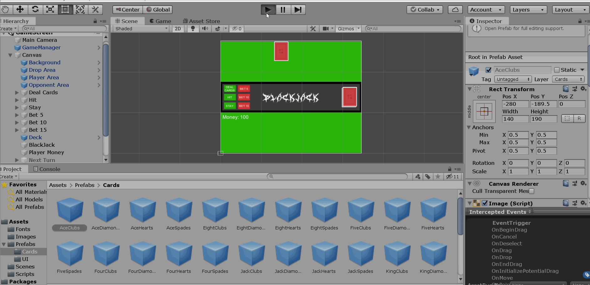

## Vanja Venezia - Milestone #2 Dev Diary

Stright up I restarted this project >5 times. At first I attempted to follow a tutorial online for some other card game that had nice 2d animations and whatnot, but I really did not like the way the person doing the tutorial was handling the deck, so after a significant amount of work down that road, I diverged. After much struggle, I decided that starting from scratch again would be best. A similar process occurred multiple more times where I tried different approaches and then scrapped everything to start fresh again. My first attempt is in my actual blackjack github and then I didnt update it with anything once I realized I was in a loop of restarting. I was going to update it when I finally decided on a path that felt right. Eventually, I landed back on using the 2d card game tutorial from Milestone #1 as a base and accidentally ended up syncing everything to my milestone 1 repository because I didn't realize how git actually handled commits and folder management etc. So that milestone 1 repository is now called blackjack-v2 and contains pretty much the full history of the final approach that I decided to utilize in building my blackjack game.

Besides the rocky start and git related troubles, where did I struggle? Pretty much everywhere.

I've learned a lot about Unity and how instantiation works, my biggest trouble was certainly despawning cards to clear the game board after a turn cycle finished. I tried disabling the clones of my prefabs only to find out that it disables the prefabs; I tried individualy destroying them multiple times from multiple scripts in multple ways and that ranged from doing completely nothing to nearly annihilating my card prefabs; I tried disabling the images in multiple ways but that also caused issues with the prefabs, even though I only had cloned card prefabs in my scene at any time; I tried moving cards offscreen somewhere or behind the canvas; I tried just about everything in every possible configuration I could think of (at least 20 different approaches, almost certainly more; I didn't bother keeping track). Eventually my struggles with the transform approach led me to realize that affecting a child element of a parent element is almost impossible without going through the parent element, and about five minutes before you checked my code I tried looping through the children of my play area objects and destroying the objects from there, which actually finally worked and made everything cleaner than I could have imagined.

The actual logic of blackjack was fine to code, I have programmed a similar game in C++ just as a text terminal before for another class so that wasn't exactly new or difficult, not that any logic should ever really be that difficult. Using canvas elements presented some issues, however, I coudln't get the alignment grid to work with sprites so I made it happen with UI. Ace logic was pretty difficult and I will admit that my code does have some minor bugs associated with particular cases of ace point calculations. For the most part, though, my ace logic works well and doesn't usually cause any issues. Blackjack and busting are calculated and a series of ifs controls differnet win, lose, or draw states dependant on whether the player or dealer busts etc.

The main thing I think I was struggling against here was not the utilization of data structures, my ability to write logic, or my ability to code in C# (which I am now super comfortable in thanks to this project so thank you for that! :) ), but rather I was struggling against Unity's Editor and base class implementation. The Unity documentation is quite extensive and good but most of the information I was able to find about specific problems I was having was either outdated or not actually useful because of some extenuating factor I was unaware had an effect. I like Unity so far overall, and can see how it can be quite efficient for 3D, but for 2D I find it incredibly asinine. Some of the quirks in Unity are absolutely ridiculous and I'm not sure why they haven't made some small tweaks to base Monobehaviour methods and Unity classes for quality of life improvement and intuitive design.

Overall, this is almost certainly the most I've learned from any project in a computer science course ever, since I took my first C++ class when I was 11 at Santa Rosa JC. I feel quite comfortable in C# and somewhat comfortable in Unity. I definitely have a handle on Lists now as well and like them even more than C++ vector implementation!

Some things I would have liked to do were minor animation, add some of my own original music to the game, sound effects, main menu, more gameplay options, potentially other modes or settings for different house rules sets, spliting, better betting, insurance, more solid ace logic, visual representation of betting, most of the other stretch goals, and maybe more customized / well thought out graphics.

That being said, I am very proud of and happy with the game I ended up with.

